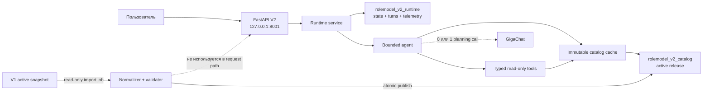
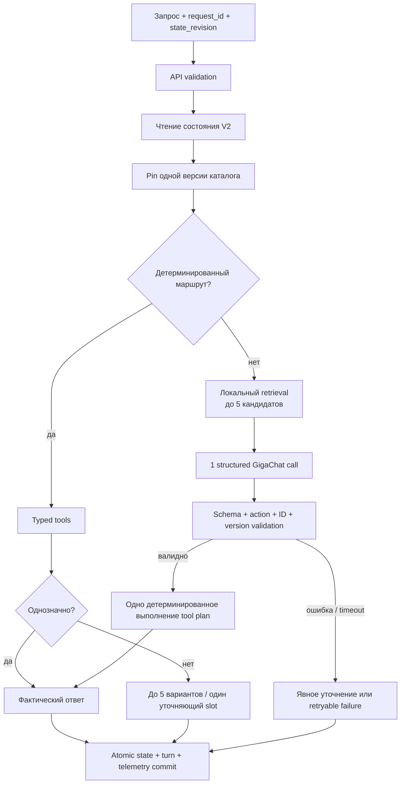
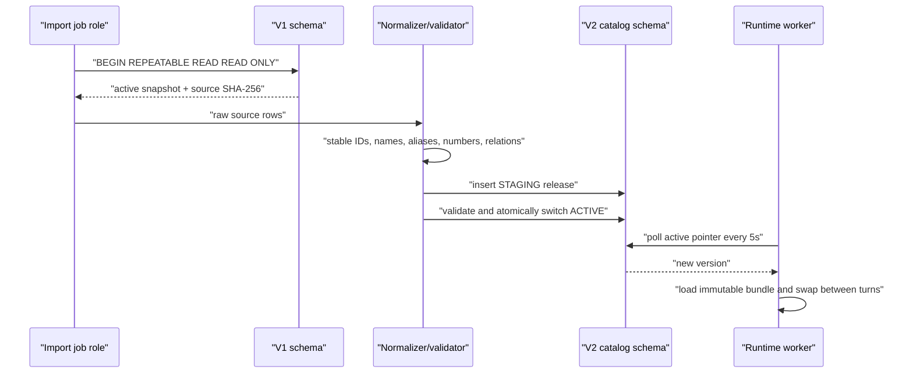

# Архитектура RoleModel Helper V2

## Разделение контуров

V1 и V2 могут находиться в одном PostgreSQL cluster и одной database.
Изоляция достигается схемами и ролями, а не отдельным сервером.

## Один пользовательский ход

Рекурсивной Hermes-подобной автономной петли здесь намеренно нет. Для
read-only поиска прав она не добавляет новых возможностей, зато увеличивает
число удалённых вызовов и время ожидания. Применена ограниченная схема:

- максимум один LLM planning step;
- максимум один детерминированный execution step;
- максимум пять кандидатов одного типа;
- состояние диалога продолжается в следующем пользовательском ходе;
- факты всегда повторно проверяются по pinned catalog version.

## Инструменты

Инструменты — обычные типизированные Python-функции над прогретым immutable
каталогом, не `grep`-скрипты и не свободный SQL модели:

| Инструмент | Назначение | Жёсткие ограничения |
|---|---|---|
| `search_departments` | подразделение по имени/номеру/городу | номер — exact filter; limit ≤ 10 |
| `search_positions` | должность с контекстом отдела/города | только найденные profile relations |
| `resolve_profiles` | профиль по отделу + должности + городу | точные foreign relations |
| `search_systems` | АС, доступные профилю | только profile access |
| `search_roles` | роли в выбранной АС | только profile + system relation |
| `get_access_instruction` | инструкция по АС | citation из каталога |

Нормализация (`№2`, `номер 2`, `второй отдел`, `2-й отдел`) выполняется при
публикации каталога. На запросе выполняется только дешёвая нормализация текста
и поиск по уже подготовленным полям.

## Что получает GigaChat

GigaChat не получает полный список АС, ролей, отделов или должностей. Payload
содержит:

- текст текущего запроса (до 2000 символов);
- компактное состояние диалога;
- catalog version;
- максимум 5 кандидатов АС/подразделений/должностей;
- максимум 3 совпавшие роли внутри кандидата АС.

Ответ модели — только план. Названия ролей, уровни доступа и инструкции
формируются из каталога после проверки ID.

## Контур каталога

Ошибка импорта или публикации не меняет предыдущий ACTIVE-релиз. Ошибка
фонового refresh оставляет last-good bundle и переводит health freshness в
`DEGRADED`.

## PostgreSQL-роли

| Роль | V1 | V2 runtime | V2 catalog |
|---|---|---|---|
| runtime app | нет доступа | SELECT/DML | SELECT |
| catalog import job | SELECT ограниченных ETL-таблиц | нет доступа | SELECT/DML |
| migration owner | по политике DBA | DDL | DDL |

Все таблицы в коде schema-qualified. Модель не получает DSN и не выполняет
SQL.

## Наблюдаемость

Каждый успешно зафиксированный ход хранит:

- trace ID, request ID, route и outcome;
- catalog version;
- число GigaChat calls (0 или 1);
- total и GigaChat latency;
- полный diagnostics JSON для локального разбора.

Команда `python -m app.runtime.telemetry --hours 24` считает p50/p95/p99 без
чтения пользовательских сообщений.
